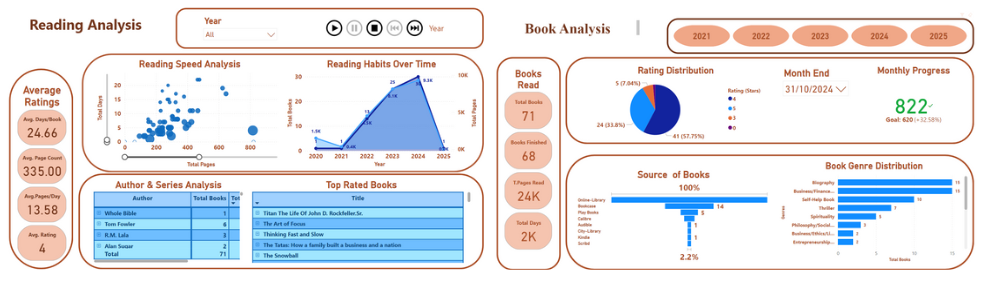

## Selected projects in data science, machine learning and NLP
---
---
### Complaint Volume Forecasting

**Machine Learning • Time‑Series Modelling • Operational Forecasting**

This project develops a production‑style forecasting pipeline to predict daily complaint volumes for operational planning, staffing optimisation, and service‑level management. The model leverages engineered time‑series features, LightGBM, and a modular ML architecture to deliver accurate, explainable, and reproducible forecasts.
The pipeline captures lag behaviour, rolling trends, and calendar effects, enabling organisations to anticipate demand patterns and proactively manage operational pressure.

**Technologies Used**

### Key Insights
* **Accuracy Performance:** Achieved **MAE 142.3**, **RMSE 198.7**, and **MAPE 12.4%**, demonstrating strong predictive accuracy on unseen data.
* **Feature Influence:** **Lag‑1**, **Lag‑7**, and the **7‑day rolling mean** emerged as the most influential drivers of complaint volume.
* **Operational Visibility:** The model provides **early detection of volume surges**, enabling teams to anticipate operational pressure.
* **Workforce Planning:** Supports **proactive staffing decisions** and strengthens service‑level performance through forward‑looking insights.

View Full Repository on   

---

### Student Risk Identification Model – Early Warning System for At-Risk Students

This project focuses on proactively identifying students at risk of not completing their studies. By analysing academic, engagement, and financial data, I developed a data-driven early intervention model that assigns each student a risk score and band (Critical/High, Medium, Low).

A weighted scoring model was designed based on three key pillars:

* **Engagement (50%)**: Attendance rate and recency of last attendance.
* **Academic (30%)**: Credits completed and whether the last assessment was submitted.
* **Financial & Status (20%)**: Outstanding fees, scholarship status, and enrolment status.

Engagement was given the highest weight because disengagement almost always precedes formal withdrawal. The model successfully flagged critical risk students and was validated against known withdrawal cases.

#### Project Insights & Strategy

[View Code on Colab](https://colab.research.google.com/drive/1KD4rMMLjbMihaEsdlhcv2lLX8eFgLVgP?usp=sharing)

[View Strategy Presentation](https://drive.google.com/file/d/1XQpaYKYKFv9KrvoDOQrB6uFR8DQ9clZf/view?usp=sharing)

---
### Unveiling the Story of My Reading Journey.

The project, "Unveiling the Story of My Reading Journey," involves the creation of an interactive Power BI dashboard that visualizes personal reading data. It analyzes various aspects, including genre distribution, reading habits over time, rating distributions, and author analyses. Key visualizations such as pie charts, line graphs, and scatter plots provide insights into reading preferences and productivity. The dashboard also tracks monthly progress towards reading goals and highlights top-rated books. This project exemplifies the effective use of data visualization techniques to derive meaningful insights from personal reading habits.

Access the dashboard here: <a href="https://app.powerbi.com/view?r=eyJrIjoiZDk1ZGQwMDgtMjVlYS00ZmRlLWEyMDAtMzYxNTQ5ODZhYTQwIiwidCI6IjhjZTBhOTAzLTYxMDQtNGY1YS1hNTZhLTk0MzQ1Mjc1NGEwMCJ9">Power BI Dashboard</a>

--- 
### Utilizing Advanced NLP Techniques for Real-time Market Sentiment Analysis in the UK's Emerging Markets.

The aim was to develop a model that leverages Natural Language Processing (NLP) techniques for sentiment analysis in rapidly evolving UK markets, specifically within sectors such as Financial Services, clean energy, and artificial intelligence (AI). The project hypothesizes a significant correlation between market sentiments and market performance and seeks to analyse sentiments expressed in various text sources like social media, financial reports, and news articles.
It underscores the evolving applicability of NLP techniques in market sentiment analysis, balancing between the innovative use of machine learning (for data preprocessing, feature extraction, and model training) and a lexicon-based approach using sentiment lexicons like VADER for text scoring.

         

---
### Unleashing the Power of Sentiment Analysis in UK’s Emerging Markets: A Journey into Real-time Market Insights.

The article explores leveraging NLP for real-time sentiment analysis in the UK's emerging markets, particularly clean energy and AI. The project involves developing an NLP model to analyze sentiments from financial texts, using mixed-methods research, web scraping, APIs, and machine learning, aiming to provide actionable insights for investors and financial institutions.

<a href="https://medium.com/@kmsibu/unleashing-the-power-of-sentiment-analysis-in-uks-emerging-markets-a-journey-into-real-time-4adac021f573" target="_blank">View Article on Medium</a>

---
### How Does the Decision Support System Assist Investors in Making Smarter Financial Decisions?

DSS tools provide investors with strategies for making informed decisions in a disciplined manner. These tools are especially useful due to the increasing number of investment options and vast amounts of market data. Financial tools within DSSs help investors determine how to invest their funds, whether they are individuals or larger investment organizations. The challenge lies in designing DSS tools that consider investors' preferences and goals while helping them overcome biases and cognitive limitations. As a result, DSS-equipped investors have improved the quality of their investment decisions, leading to increased earnings and decreased risk.

<a href="https://medium.com/@kmsibu/how-does-the-decision-support-system-assist-investors-in-making-smarter-financial-decisions-5f17f8d885a" target="_blank">View Article on Medium</a>

---
### Skills-based Projects
---
A selection of smaller projects demonstrating specific data science and ML skills.

<a href="https://mathaisibu.github.io/" target="_blank">Working in the cloud: Using data stored in Azure Blob Buckets.</a>

<a href="https://mathaisibu.github.io/" target="_blank">Optimising code with multiprocessing.</a>

